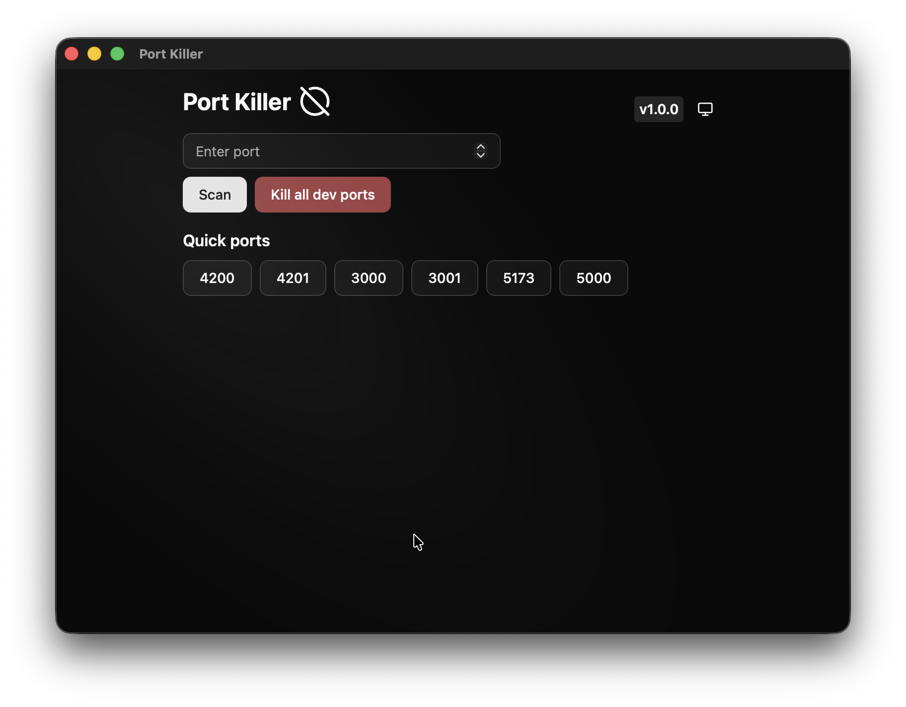

<div align="center">
  

# Port Killer

[](https://github.com/Khumozin/port-killer/actions/workflows/ci.yml)
[](https://github.com/Khumozin/port-killer/actions/workflows/semantic-release.yml)

A cross-platform desktop application to manage and terminate processes running on specific ports.

Built with Angular and Tauri.

</div>

---

## Getting Started

### Development

```bash
# Start development server
npm start

# Run desktop application
npm run tauri:dev
```

### Build

```bash
# Build web application
npm run build

# Build desktop application with installers
npm run tauri:build
```

### Testing

```bash
# Run unit tests
npm test
```

## License

MIT
