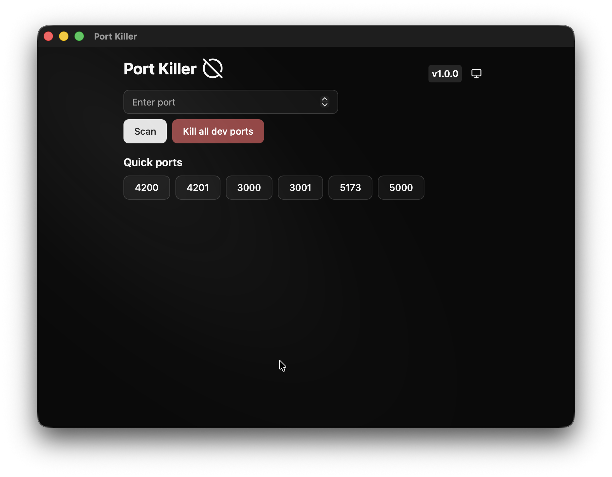

<div align="center">
  

# Port Killer

[](https://github.com/Khumozin/port-killer/actions/workflows/ci.yml)
[](https://github.com/Khumozin/port-killer/actions/workflows/semantic-release.yml)

A powerful desktop application for developers to manage and terminate processes running on specific ports with insights into why they're running.

Built with Angular 21 and Tauri 2.

</div>

---

## Features

- **Port Scanning** - Quickly find processes running on specific ports
- **Parent Process Chain** - See the full ancestry of each process from immediate parent up to launchd/init (inspired by [witr](https://github.com/pranshuparmar/witr))
- **Process Details** - View PID, command, user, and full command line with arguments
- **Quick Actions** - Pre-configured buttons for common development ports (3000, 4200, 5173, etc.)
- **Bulk Operations** - Kill all processes on common development ports at once
- **Beautiful UI** - Modern, accessible interface with dark/light mode support
- **Cross-Platform** - Works on macOS, Linux, and Windows

## Why Is This Running?

Unlike traditional process managers that just show *what* is running, Port Killer shows you the **causal chain** - explaining exactly how a process came to exist:

```
Process on Port 3000
├─ PID: 12345
├─ Command: node
├─ User: john
└─ Full Command: node server.js --port 3000

Parent Process Chain:
1. PID 12345 → node (john)
   node server.js --port 3000
2. PID 1234 → bash (john)
   /bin/bash
3. PID 1 → launchd (root)
   /sbin/launchd
```

This makes debugging much faster by showing you whether a process was started by:
- Your IDE or terminal
- A process manager (PM2, systemd, etc.)
- Docker or another container runtime
- A script or cron job

## Getting Started

### Development

```bash
# Start development server
npm start

# Run desktop application
npm run tauri:dev
```

### Build

```bash
# Build web application
npm run build

# Build desktop application with installers
npm run tauri:build
```

### Testing

```bash
# Run unit tests
npm test

# Run Rust tests
cd src-tauri && cargo test
```

## Technology Stack

**Frontend:**
- Angular 21 with standalone components
- Signals for reactive state management
- Spartan UI components (headless component library)
- Tailwind CSS for styling
- Vitest for unit testing

**Backend:**
- Tauri 2 (Rust + WebView)
- Native system commands (`lsof`, `ps`, `kill`)
- Comprehensive Rust unit tests

## Platform Support

| Platform | Status | Implementation |
|----------|--------|----------------|
| macOS | Fully supported | Uses `lsof`, `ps`, and `kill` commands |
| Linux | Planned | Future release |
| Windows | Planned | Future release |

## How It Works

Port Killer uses native system commands to interact with processes:

1. **Finding processes** - Uses `lsof` to find processes listening on TCP ports
2. **Getting details** - Uses `ps` to retrieve process information including parent PIDs
3. **Building ancestry** - Recursively walks the parent process chain up to PID 1
4. **Terminating processes** - Uses `kill -9` to forcefully terminate processes

All system interactions happen in the Rust backend for security and performance.

## Development

This project follows Angular and TypeScript best practices:

- TypeScript strict mode
- Standalone components (no NgModules)
- Signals for state management
- OnPush change detection
- Semantic HTML with ARIA attributes
- Comprehensive test coverage

See [.claude/CLAUDE.md](.claude/CLAUDE.md) for detailed development guidelines.

## Contributing

Contributions are welcome! Please feel free to submit a Pull Request.

## Acknowledgments

- Inspired by [witr](https://github.com/pranshuparmar/witr) for the "why is this running" concept
- Built with [Tauri](https://tauri.app/) for cross-platform desktop apps
- UI components from [Spartan](https://www.spartan.ng/)

## License

MIT
